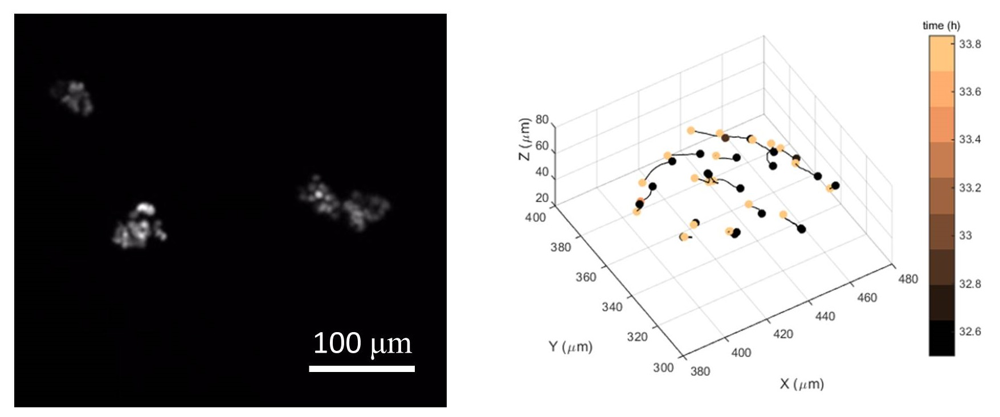
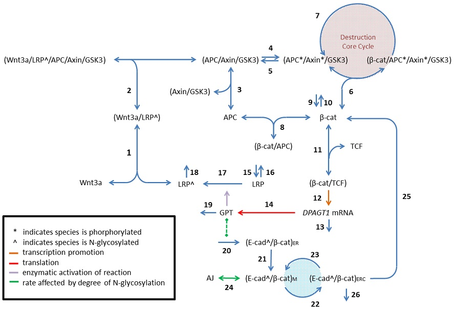
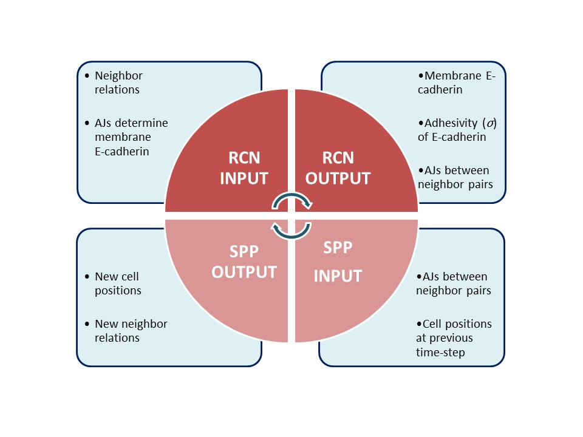
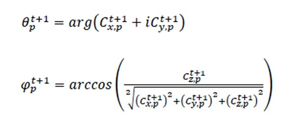
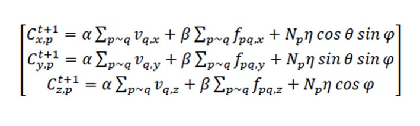
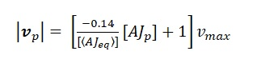
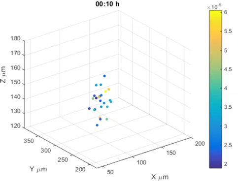

# SPPRCN

SPP-RCN refers to Self-Propelled Particle and Regulatory Cell Network models. This project repository contains code to run a multiscale computational model exploring the role of cellular pathway regulation of cell-adhesion in collective cell migration as observed in vitro (but hopefully representative of metastatic process).

This code was developed together with Dr. Yasha Sharma as  part of our PhD training under the supervision of Prof. Muhammad Zaman at Boston University between 2013 and 2015.

## About the Project

The modeling project was developed in the context of  the  study  of collective cell migration. Collective cell migration is ubiquitous in biology and occurs from development to cancer. An in vitro model was developed by groups at Harvard and Boston University, looking at cohorts of 10-30 cells with fluorescent nuclei moving in a 3D collagen gel. This system allowed  to  quantify individual cell migration within cohorts over time.

This work can be found here:
*Sharma, Y. ; Vargas, D. A. ; Pegoraro, A. F. ; Lepzelter, D. ; Weitz, D. A. ; Zaman, M. H. Collective motion of mammalian cell cohorts in 3D. Integrative Biology 2015, 7 1526–1533.*

 

**Figure 1** - (left) Confocal image of fluorescent nuclei showing three distinct cell cohorts. (right) Tracking of nuclei during of rotation event of cohort over 1h.

Exploring the subcellular regulation (meaning intracellular signaling) of migration required  building of a multi-scale model that incorporated both an agent-based model of collective cell migration and a numerical model of cellular pathway network regulating cell adhesion.

## Models

### Self-Propelled Particle (SPP) Model

Initially developed in the 1980s by Craig Reynolds, boids (referring to bird-like objects) were simulated objects that moved based on interactions with their neighbors. This was an attempt to understand  bird  flocking. Since then, many collective bodies, including groups of humans  have been simulated with this method.

We took work by Grégoire et al. (Phys. Rev. Lett.  92,  025702) from 2004, gave the particles a physical  (spherical) body, and scaled simulations to 3D. We also used methods used  to describe collective phenomena in physics  (e.g. order parameters and RMSD) and  adapted it to describe temporal dynamics of the simulated particles.

Essentially, at every  step, the directionality of a particle is dictated by the average direction of its immediate  neighbors. The effect of particle-particle interactions  are  transmitted  across the collective, giving rise to  collective  behavior.

### Regulatory Cell Network (RCN) Model

A numerical model based on Differential Algebraic Equations (DAE) had been developed in parallel  to  describe how adherens junctions (AJ) (or cell-cell adhesions) were regulated in epithelial tissues.

Cadherins are the most studied cell-cell adhesion molecule. Their adhesiveness is affected by post-translational modifications, specifically carbohydrates (N-glycans) added on the outside of the cell. What steps were the most impactful in determining adhesion (potentially, permanence of a cell in a tissue)? 

This model integrated distinct  cellular pathways into a single network:
- Wnt / beta catenin signaling
- N-glycosylation of E-cadherin and transcriptional regulation of N-glycosylating enzyme (DPAGT1 gene)
- E-cadherin reycycling between ER and plasma  membrane

 

**Figure 2** - Molecules involved in numerical model.

This work can be found here:
*Vargas DA, Sun M, Sadykov K, Kukuruzinska MA, Zaman MH (2016) The Integrated Role of Wnt/β-Catenin, N-Glycosylation, and E-Cadherin-Mediated Adhesion in Network Dynamics. PLoS Comput Biol 12(7): e1005007.*

A summary of the equations and parameter values can be found in a pdf file in this  repository: *ODE_pathway_network_model/SystemOfEquations_and_Parameters*.

## Model integration

We incorporated the intracellular Regulatory Cell Network (RCN) for cell-cell adhesion into an agent-based model of a cell collective. We used the Self-Propelled Particle (SPP) modeling to model the interaction of hundreds of cells in 3D space and integrated the differential algebraic model at the level of each individual cell. This allowed us to hypothesize on the effect of individual biochemical processes inside the cell on cell collective migration.

 

**Figure 3**  - Schematic showing information workflow in simulation between scales at cell level (i.e. SPP) and subcellular level (i.e. RCN).

Model was developed in MATLAB.

Main parameters dictating behavior are α, β, and noise (η): α scales the influence of the neighbors’ velocities on the particle’s preferred direction (i.e. collectivity factor), while β scales the attraction or repulsion force (fpq) exerted on a particle p due to proximity to its neighbors q to ensure volume exclusion.

Another set of important parameters in SPP models are the number of cell (N) in a 3D periodic space of dimensions L x L x L. While we kept  N and L in line with the in vitro experiments, the study explored  the effect of alpha and beta in the formation and movement of cell cohorts, as well as  the  effect of the RCN on collective  behavior.

 

**Figure 4** - Equations for update of cell direction of  motion based on angle calculations: _theta_ for x,y-plane and _phi_ for z-direction. Cx,p, Cy,p, and Cz,p describe the Cartesian coordinates of a particle in the x,y, and z directions.

 

**Figure 5** - Equations for update of cell position (i.e. displacement) based on direction and parameters alpha, beta, noise (Np).

 

**Figure 6** -  Effect of adjerens junction (AJ) concentration on speed (vp) of each particle p: vp is determined by scaling the maximum possible speed vmax = 0.2 μm/min by the scaling factor contained in straight brackets. AJp stands for the AJ expression by particle p, while <AJeq> is the approximate expression of AJs at equilibrium (determined by RCN model).

#### Running the Code

All scripts can  be  found in folder *MATLAB_code*:

To run, start *main_conc_ser.m*

Once finished, there  are two options for  visualization  of the  particle migration and molecular concentrations in folder *MATLAB_code/simulation_visualization*:

- *visualize_migration_trange.m:* 		arguments should  be  in_mat=cell_mat, t1 and t2  should be integers that span the range of simulated steps (default: 1,5000).
- *visualize_migration_trange_color.m:*	arguments should  be  in_mat=cell_mat, conc=cell_conc,  molecule can be any integer between 1-23 to select the molecule to be used for coloring based on concentration (see PDF *ODE_pathway_network_model/SystemOfEquations_and_Parameters*), t1 and t2  should be integers that span the range of simulated steps (default: 1,5000).

 

**Figure 7**- Simulated cohort, colored by AJ concentration.

## Improvements Implemented but not Shared

A version of the model that parallelized the code was also developed. The DAEs for the RCN were solved in parallel in different processing cores. This  sped up the code and allowed for longer simulations. The code is not shared, since this requires a Mathworks toolbox (Parallel computing) not available with the standard license.